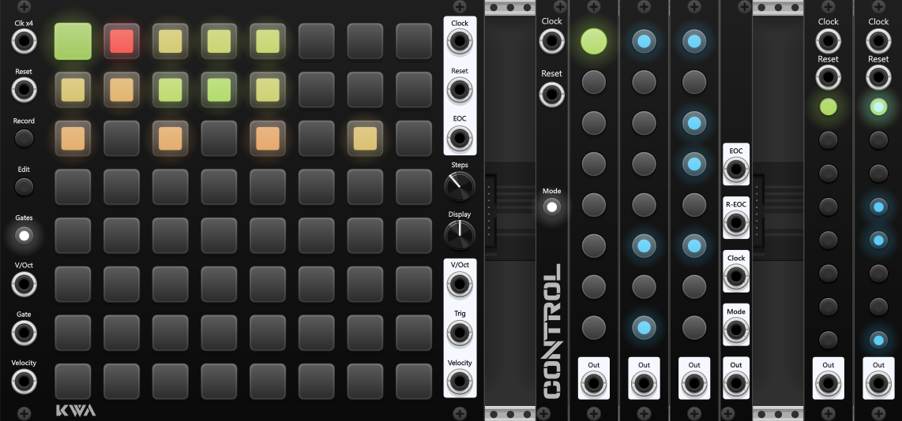
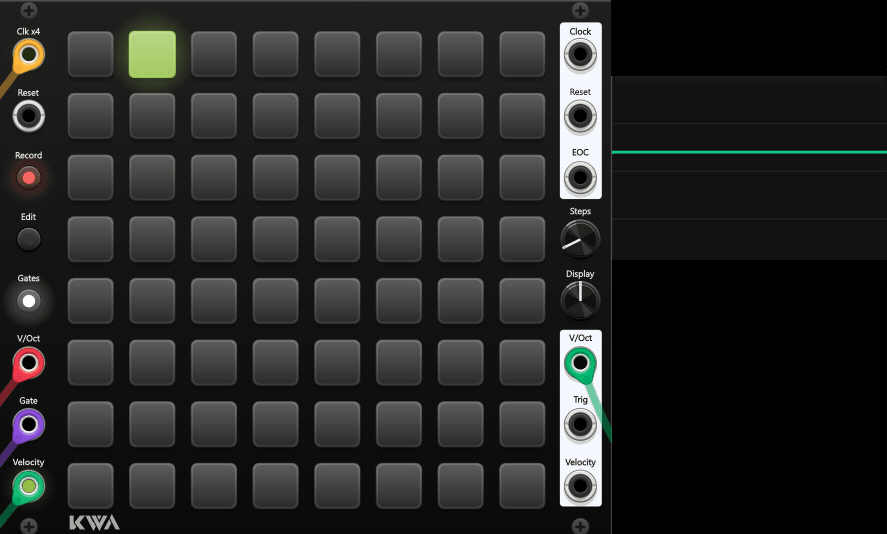
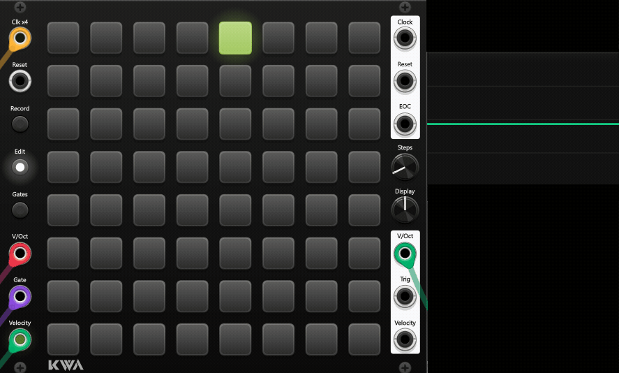
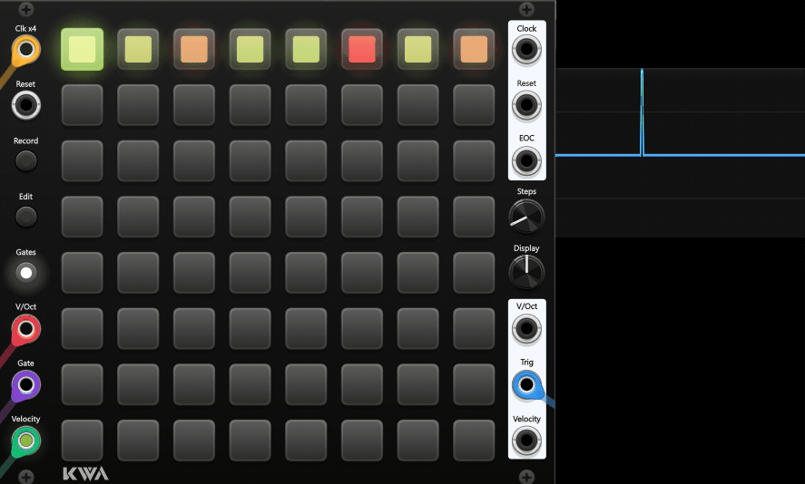
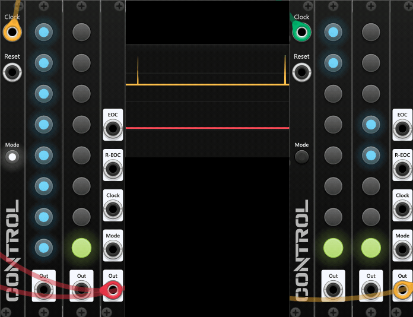
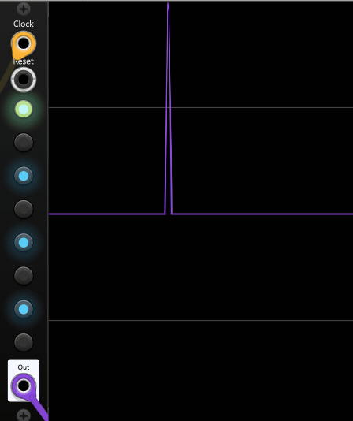

<h1>
KWA Modules for VCV Rack 2
</h1> 

A collection of sequencer modules for VCV Rack 2

  

<h2>KWA Pitch 64</h2>
64 step pitch sequencer with voct / velocity recording

- **Record** - When gate input is received, records voct / velocity inputs to the current 4x clock quantized
   step
  
  
  
- **Edit** - Select multiple steps and set them to input voct / velocity when an input gate is received. When one step is selected, record inputs step by step when gate input is triggered.

  
  
- **Gates** - Erases data from a step, or marks that a trigger signal should be there
  
  
  
- **Display knob** - Switches between display modes 
	- Gates,
	- V/Oct (normalized red to green)
	- Velocity (normalized dim red to bright red)
- **Step Knob** Selects number of steps the sequencer should step through

<h2> KWA Control 8 </h2>

Expandable 8 step trigger / drum sequencers

 <h3> Control 8 Manager </h3>
 
**Ctrl 8's main controller** - Signals chain to all connected control 8 sequencers, continuous mode steps through each chained sequencer sequentially.
 <h3> Control 8 </h3>
 
 **Ctrl 8's sequencer modules** - any number can be chained and run in parallel or stepped through sequentially if manager's continuous mode button is pressed.
 <h3> Control 8 Monitor </h3>
 
 **Ctrl 8's chained outputs** - Contains a global output for any stepped trigger, as well as various other useful chain outputs

 
<h2>KWA Trig 8</h2>

Simplified Control 8 sequencer with standalone clock / reset input, compatible with all KWA Control 8 expanders / sequencers.

